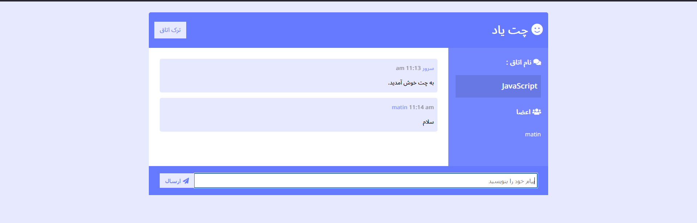

# Node.js and Socket.IO Real-Time Chat Application

A real-time chat application built with Node.js and Socket.IO, enabling instant bidirectional communication between connected users. This project demonstrates event-driven architecture, WebSocket communication, and the implementation of real-time features for modern web applications.

---

## ✨ Features

- Real-time messaging with Socket.IO
- Instant bidirectional communication
- Multiple users connected simultaneously
- Join and leave chat rooms
- Live user connection and disconnection updates
- Automatic message timestamping
- Responsive and intuitive chat interface
- Event-driven communication architecture
- Fast and lightweight server implementation

---

## 🛠️ Tech Stack

### Backend
- Node.js
- Express.js

### Real-Time Communication
- Socket.IO

### Utilities
- Moment.js

---

## 🚀 How to Run

1. Clone the repository

```bash
git clone https://github.com/matinporkar/Node.js-and-Socket.IO-Real-Time-Chat-Application.git
```

2. Navigate to the project directory

```bash
cd Node.js-and-Socket.IO-Real-Time-Chat-Application
```

3. Install dependencies

```bash
npm install
```

4. Start the development server

```bash
npm start
```

5. Open your browser and visit:

```
http://localhost:3000
```

6. Open multiple browser tabs or windows to test real-time communication.

---

## 🎯 Purpose of This Project

This project was developed to demonstrate real-time communication using Socket.IO and event-driven programming with Node.js. It focuses on implementing instant messaging, managing client-server events, and handling multiple concurrent connections efficiently.

It showcases practical experience in building real-time web applications, working with WebSockets, and designing responsive communication systems using modern Node.js technologies.

---

## 📩 Feedback

If you have any suggestions, improvements, or feedback, feel free to open an issue or submit a pull request.
